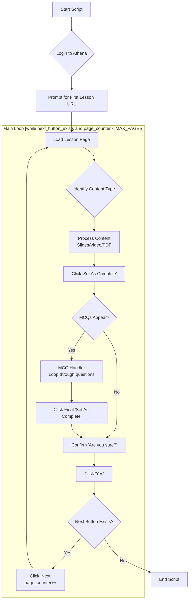

---

# 🧠 ATHENA AUTOMATION PLAN

### Automating ALX Athena course navigation and MCQ completion

**Tech stack:**

* **Playwright (Python or Node)** for browser automation
* **Google Gemini SDK** for question answering (using VTT or Slides data)
* **Google Slides SDK** for reading slide content
* **VTT Parser** (optional custom logic or Python built-in) for video captions

---

## 🎯 Core Objective

Automate the entire course flow on ALX Athena by:

1. Navigating lessons automatically
2. Detecting and processing the embedded content (Slides, Video, or PDF)
3. Answering MCQ questions (via Gemini)
4. Marking each page as complete
5. Progressing through all lessons until the course ends

Human interaction should only be required for providing the initial lesson URL or when selectors need revalidation.

---
---

## 📊 VISUAL ARCHITECTURE



---

## 🧩 MODULE BREAKDOWN

### 1. **Navigator Module**

Handles course navigation and determines what content each page contains.

#### Tasks:

* Wait for the page to load fully.
* Detect embed type by scanning DOM for:

  * `iframe[src*="slides"]` → Google Slides
  * `iframe[src*="pdf"]` or `embed[type*="pdf"]` → PDF
  * `video` or `iframe[src*="youtube" or "video"]` → Video
* Detect presence of **“Set As Complete”** button.
* Detect whether MCQs appear after clicking “Set As Complete”.

#### Logic Flow:

1. Identify the content type.
2. Pass type to the **Content Processor Module**.
3. After processing, click “Set As Complete”.
4. Handle any MCQs.
5. Confirm “Yes” when asked if you want to set as complete.
6. Click “Next” to go to the next lesson.

---

### 2. **Content Processor Module**

Processes the learning material based on embed type.

#### **A. PDF**

* No processing needed.
* Skip directly to “Set As Complete”.

#### **B. Google Slides**

* Extract the embed URL from the `iframe`.
* Use **Google Slides SDK** to:

  * Fetch slide text from each page.
  * Combine all text into one string or structured document.
* Save locally as `.txt` (optional for logging).
* Feed text to Gemini when answering MCQs.

#### **C. Video**

* Start playback for a few seconds to trigger subtitle loading.
* Wait for `.vtt` requests to appear in the network tab.
* Once `.vtt` is found, extract URL and download.
* Convert `.vtt` → plain text transcript.
* Save transcript with timestamped filename (e.g., `2025-11-02_lecture1.txt`).
* Feed transcript text to Gemini when answering MCQs.

---

### 3. **MCQ Handler Module**

Handles all question-answer logic.
Triggered after clicking “Set As Complete” **if** MCQs appear.

#### Logic:

1. Wait for the first question to appear.

2. Extract:

   * Question text
   * Four option texts

3. Send prompt to Gemini SDK:

   **Prompt Template:**

   > You are a course assistant answering multiple-choice questions based on the provided learning content.
   > Use the context below to answer each question.
   > Always return your response strictly in JSON format:
   > `{ "answer_index": <1–4>, "reason": "<brief reason>" }`
   > Context: {slides_or_video_text}
   > Question: {question_text}
   > Options: {options_list}

4. Parse Gemini’s JSON output.

5. Click the answer that corresponds to `answer_index`.

6. Click “Next”.

7. Repeat until all questions are answered.

8. Wait for **“How did you do?”** modal to appear.

9. Click the **second “Set As Complete”** button.

10. Wait for “Are you sure?” modal and click **“Yes”**.

---

### 4. **Completion Handler Module**

Handles final confirmation and navigation to the next lesson.

#### Logic:

1. Wait for “Are you sure?” modal.
2. Click “Yes”.
3. Wait for navigation or completion confirmation.
4. Locate and click the “Next” button.
5. If “Next” doesn’t exist → course complete → exit loop.

---

## 🔄 FULL EXECUTION FLOW

### Step-by-step Automation Cycle

1. Script starts and automatically logs into Athena using credentials from a `.env` file.
2. After login, the script prompts the user in the terminal to provide the **first lesson URL**.
3. A configurable `MAX_PAGES` variable will limit how many times the script clicks "Next". For example, if set to `3`, it will process three lessons and then stop.
3. Navigator loads the page and identifies embed type.
4. Processor extracts relevant content.
5. Script clicks “Set As Complete”.
6. If MCQs appear:

   * Loop through each question → ask Gemini → click answers → next.
   * After final “How did you do?” modal → click inner “Set As Complete”.
7. “Are you sure?” prompt appears → click “Yes”.
8. Click “Next” → increment page counter → repeat process.
9. Stop when no “Next” button is found or when the page counter reaches `MAX_PAGES`.

---

## 🧰 ENVIRONMENT SETUP

* **Playwright**

  * Headed mode for debugging.
  * Network interception enabled (to catch `.vtt` files).
  * Timeout handling on every major step.

* **Google SDKs**

  * Google Slides API: `slides_v1.presentations.get(presentationId)`
  * Google Gemini SDK for LLM answering
  * Credentials (including login username and password) stored in `.env` file

* **Local Storage**

  * `/slides/` folder for text extracted from slides
  * `/transcripts/` folder for `.vtt`-derived transcripts
  * `/logs/` for tracking completed lessons

---

## 🧠 FUTURE IMPROVEMENTS

* Add progress persistence (resume from last incomplete page)
* Integrate retry logic for failed network loads
* Cache LLM answers for repeated questions
* Add summary extraction for learning reinforcement

---

## ✅ Example High-Level Pseudocode

```python
page_counter = 0
MAX_PAGES = 3  # Configurable limit

while next_button_exists() and page_counter < MAX_PAGES:
    page_type = detect_content_type()
    
    if page_type == "slides":
        content = extract_slides_via_sdk()
    elif page_type == "video":
        content = extract_vtt_transcript()
    else:
        content = None  # PDF or static page

    click("Set As Complete")
    
    if detect_mcq_modal():
        while mcq_exists():
            question, options = extract_mcq()
            answer = gemini_answer(content, question, options)
            click_option(answer["answer_index"])
            click("Next")
        click("Set As Complete")  # inside 'How did you do?' modal

    click("Yes")  # confirm completion
    click("Next")
    page_counter += 1
```

---
